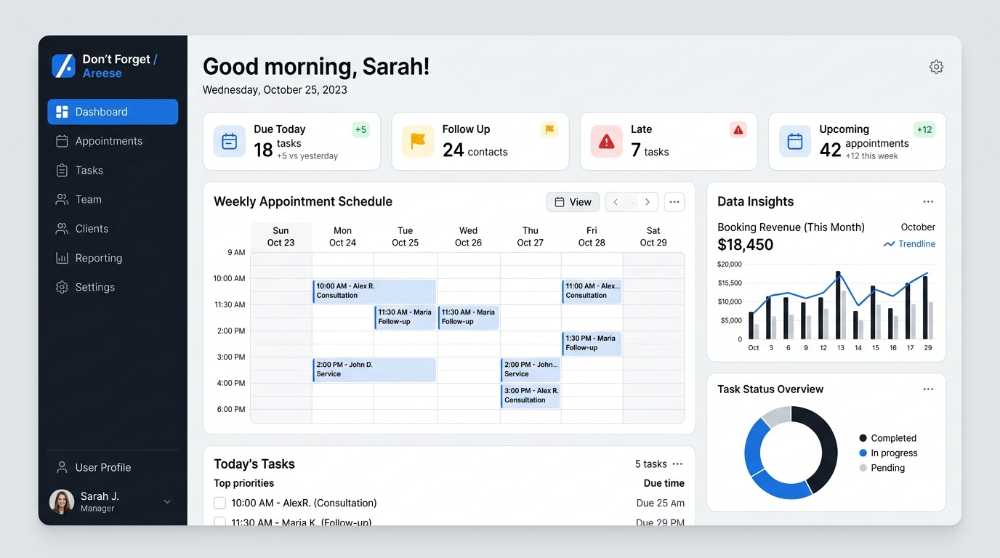
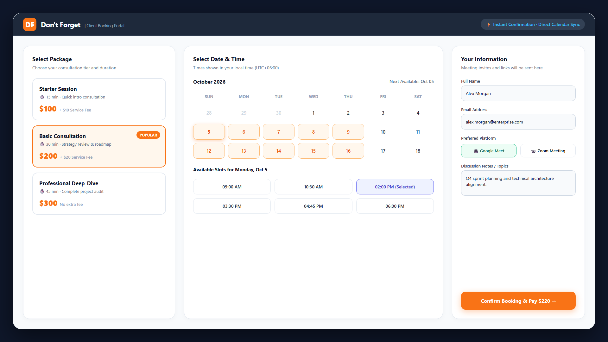
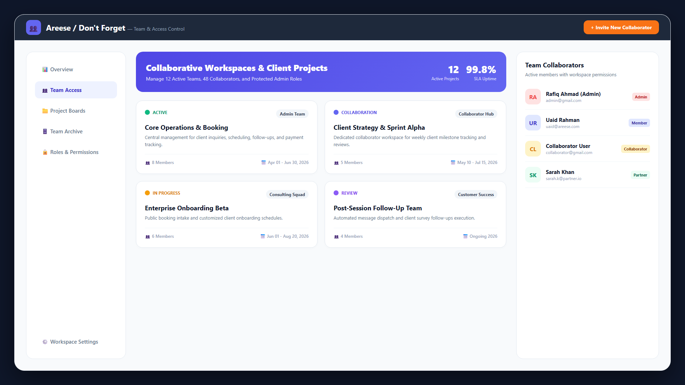
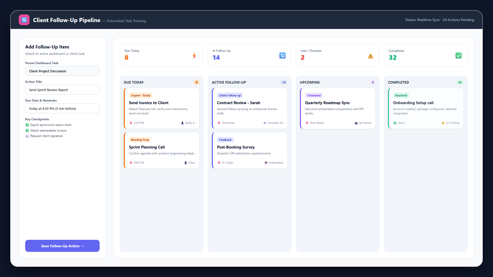
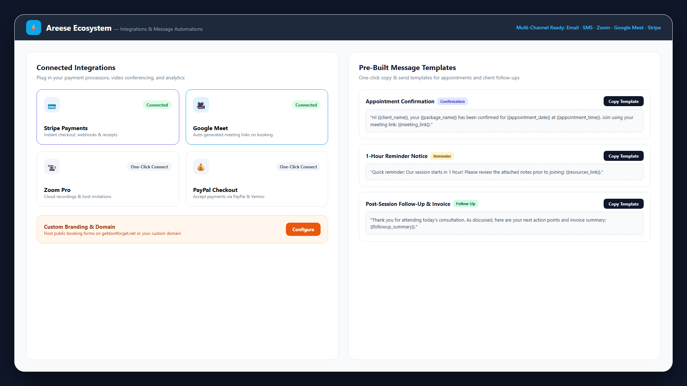
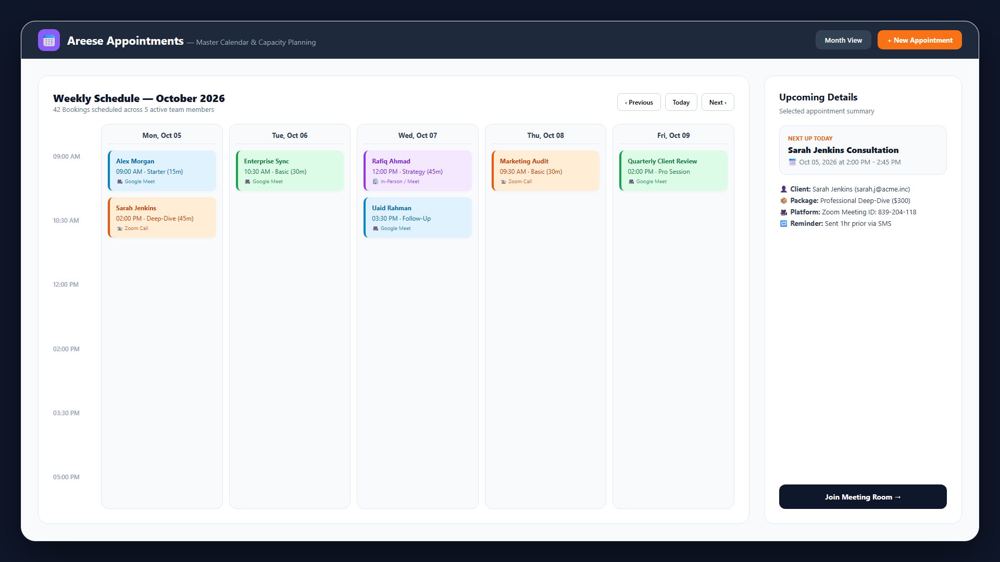
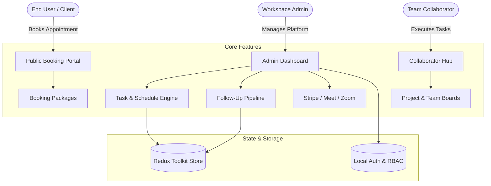

# Areese (Don't Forget) — Intelligent Appointment & Team Operations SaaS

<div align="center">



<br/>

[](https://react.dev/)
[](https://www.typescriptlang.org/)
[](https://vitejs.dev/)
[](https://tailwindcss.com/)
[](https://redux-toolkit.js.org/)
[](https://vercel.com/)

**Next-generation client booking, appointment management, and team collaboration platform.**  
*Stay organized, automate follow-ups, and never let a client or deadline slip through the cracks.*

[Explore Live Demo](https://getdontforget.net) · [Staging Preview](https://areese-frontend.vercel.app) · [Report Bug](https://github.com/Ramjanict/areese-frontend/issues) · [Request Feature](https://github.com/Ramjanict/areese-frontend/issues)

</div>

---

## 📖 Table of Contents

- [Overview](#-overview)
- [Live Environments](#-live-environments)
- [Demo Credentials](#-demo-credentials)
- [Visual Showcase](#-visual-showcase)
- [Key Features](#-key-features)
  - [Public & Client Experience](#-public--client-experience)
  - [Admin Command Center](#-admin-command-center)
  - [Collaborator Workspace](#-collaborator-workspace)
  - [Automation & Integrations](#-automation--integrations)
- [System Architecture](#-system-architecture)
- [Tech Stack](#-tech-stack)
- [Project Structure](#-project-structure)
- [Quick Start Guide](#-quick-start-guide)
- [Role-Based Access Control](#-role-based-access-control)
- [Deployment](#-deployment)
- [Contributing](#-contributing)
- [License](#-license)

---

## 🌟 Overview

**Areese** (branded as **Don't Forget**) is an all-in-one business operations and appointment scheduling platform designed for consultancies, agencies, and service professionals. It combines public client scheduling with deep internal operational workflows — including smart follow-up queues, team project tracking, automated message templates, and multi-channel video conferencing integrations.

---

## 🌐 Live Environments

| Environment | Link | Purpose |
|:---|:---|:---|
| 🚀 **Production** | [https://getdontforget.net](https://getdontforget.net) | Production application domain |
| 🧪 **Staging / Vercel** | [https://areese-frontend.vercel.app](https://areese-frontend.vercel.app) | Continuous deployment preview |

---

## 🔐 Demo Credentials

Experience the platform immediately with ready-to-use role profiles:

### 👑 Administrator Account
- **URL**: [`/login`](https://getdontforget.net/login)
- **Email**: `admin@gmail.com`
- **Password**: `Admin@12345`
- **Permissions**: Full workspace administration, financial packages, client booking links, collaborator management, integrations, and global settings.

### 🤝 Collaborator Account
- **URL**: [`/login`](https://getdontforget.net/login)
- **Email**: `collaborator@gmail.com`
- **Password**: `Collaborator@12345`
- **Permissions**: Assigned team project boards, task tracking, collaborator overview, and appointment schedules.

---

## 📸 Visual Showcase

### 1. Unified Dashboard & KPI Insights
Track due dates, overdue tasks, follow-ups, and booking trends at a glance.


### 2. Public Client Booking & Package Checkout
Allow clients to select service tiers, choose available slots, and confirm appointments with built-in Google Meet or Zoom.


### 3. Team Collaboration & Access Control
Manage multi-team project boards, invite team members, and enforce strict role boundaries.


### 4. Automated Follow-Up Pipeline
Track every client interaction with status queues (`Due Today`, `Follow-Up`, `Late`, `Upcoming`).


### 5. Multi-Channel Integrations & Pre-Built Message Templates
Connect Stripe, PayPal, Google Meet, and Zoom while utilizing rapid copy-to-clipboard communication templates.


### 6. Master Appointment Calendar
Comprehensive schedule view with time-slot management and participant details.


---

## ✨ Key Features

### 🏠 Public & Client Experience
- **Responsive Landing Page**: Hero section, animated feature banner, pricing tiers, and interactive accordion FAQs.
- **Self-Serve Booking**: Shareable public links (`/book?link=...`) with custom booking caps and optional post-booking redirects.
- **Transparent Packages**: Flexible pricing packages with duration notes, session fees, and meeting platform preferences.
- **Content & Resources**: Knowledge base with dedicated blog category filters and article views.

### 📊 Admin Command Center
- **Executive Analytics**: Real-time stats for *Due Today*, *Follow Up*, *Late*, and *Upcoming* tasks with trend indicators.
- **Task & Event Creator**: Configurable repeat frequencies, custom tags, resources, reminders, and video platform bindings.
- **Service Package Builder**: Create, edit, and archive appointment packages with pricing, duration, and service fees.
- **User Management**: Centralized user directory with search, status filters, and role configurations.
- **Follow-Up Automation**: Dedicated multi-stage follow-up engine ensuring no lead or client deliverable is forgotten.

### 👥 Collaborator Workspace
- **Scoped Access**: Clean, distraction-free interface tailored for assigned team collaborators.
- **Project Tracking**: Milestone and deadline tracking across active client projects.
- **Team Directory & Archive**: Searchable archive of completed and active team engagements.

### ⚡ Automation & Integrations
- **Payment Gateways**: Integrated Stripe and PayPal checkout flows.
- **Video Conferencing**: Native Google Meet and Zoom meeting creation.
- **One-Click Message Templates**: Pre-configured confirmation messages, 1-hour reminders, and post-session follow-ups with dynamic variable placeholders.
- **Branding & Whitelabel**: Custom logo uploads, brand color themes, and domain configurations.

---

## 🏗️ System Architecture



---

## 🛠️ Tech Stack

| Domain | Technology | Description |
|:---|:---|:---|
| **Frontend Framework** | [React 19](https://react.dev/) | Latest modern React with concurrent features and component architecture |
| **Language** | [TypeScript 5.9](https://www.typescriptlang.org/) | Strict typing, robust interfaces, and full type safety |
| **Build & Tooling** | [Vite 7](https://vitejs.dev/) | Ultra-fast HMR and optimized production bundling |
| **Styling** | [Tailwind CSS v4](https://tailwindcss.com/) | Modern CSS-first utility framework with dynamic design tokens |
| **Component Library** | [Radix UI](https://www.radix-ui.com/) & [shadcn/ui](https://ui.shadcn.com/) | Accessible, unstyled primitives with custom styling |
| **State Management** | [Redux Toolkit 2.11](https://redux-toolkit.js.org/) | Centralized store for dashboard states, team filters, and data slices |
| **Routing** | [React Router DOM v7](https://reactrouter.com/) | Declarative nested routing with protected route guards |
| **Form Handling** | [React Hook Form](https://react-hook-form.com/) + [Zod 4](https://zod.dev/) | High-performance schema validation and reactive inputs |
| **Data Visualization**| [Recharts 2.15](https://recharts.org/) | Composable SVG-based responsive analytics and trend charts |
| **Rich Text Editor** | [Tiptap 3.20](https://tiptap.dev/) | Headless WYSIWYG editor for blog posts and template creation |
| **Motion & FX** | [Framer Motion 12](https://www.framer.com/motion/) | Smooth entrance animations and micro-interactions |
| **Icons & Alerts** | [Lucide React](https://lucide.dev/), [React Icons](https://react-icons.github.io/react-icons/), [Sonner](https://sonner.emilkowal.ski/), [Toastify](https://fkhadra.github.io/react-toastify/) | Modern vector icons and non-blocking notifications |

---

## 📁 Project Structure

```
areese-frontend/
├── public/                     # Public assets & site branding
│   ├── logo.png
│   └── favicon.ico
├── src/
│   ├── assets/
│   │   └── images/             # Feature mockups, previews & brand visuals
│   │       ├── appointment-calendar-view.png
│   │       ├── dashboard-preview.jpg
│   │       ├── followup-workflow-automation.png
│   │       ├── integrations-and-templates.png
│   │       ├── public-booking-portal.png
│   │       ├── team-collaboration-hub.png
│   │       └── ...
│   ├── components/
│   │   ├── layout/             # MainLayout, CollaboratorLayout, Navbars, Sidebars
│   │   ├── shared/             # Reusable UI components (Modals, StatCards, Selects)
│   │   └── ui/                 # shadcn/ui and Radix primitives
│   ├── features/               # Modular domain features
│   │   ├── Appointment/        # Appointment lists and scheduling
│   │   ├── blog/               # Blog articles and category management
│   │   ├── dashboard/          # Analytics widgets and task activity feeds
│   │   ├── home/               # Public landing page and pricing components
│   │   ├── messageTemplate/    # Pre-built copyable message templates
│   │   ├── package/            # Consultation package creation and listing
│   │   ├── profile/            # User profile and settings
│   │   ├── publicBooking/      # Client-facing appointment booking flow
│   │   ├── settings/           # Integrations, Branding, Booking Caps, Account
│   │   ├── task/               # Task and appointment creation forms
│   │   ├── team/               # Team projects and modals
│   │   ├── teamAccess/         # Team member invitations and permissions
│   │   └── user/               # Platform user administration
│   ├── hooks/                  # Custom hooks (e.g. use-mobile, useDebounce)
│   ├── lib/                    # Utility helpers, date formats, cn merger
│   ├── pages/                  # Top-level page routes
│   ├── routes/                 # Router configuration and ProtectedRoute guards
│   ├── store/                  # Redux Toolkit store and feature slices
│   ├── App.tsx                 # Root component wrapper
│   └── main.tsx                # Entry point
├── package.json
├── tsconfig.json
├── vercel.json                 # SPA rewrite configuration
└── vite.config.ts
```

---

## ⚡ Quick Start Guide

### Prerequisites
- **Node.js**: `v18.0.0` or higher (tested on `v20.x` and `v22.x`)
- **Package Manager**: `npm` (`v9.x`+) or `pnpm` / `yarn`

### Installation

```bash
# 1. Clone the repository
git clone https://github.com/Ramjanict/areese-frontend.git

# 2. Change into the project directory
cd areese-frontend

# 3. Install dependencies
npm install

# 4. Start local development server
npm run dev
```

Visit [`http://localhost:5173`](http://localhost:5173) in your browser.

### Available Scripts

| Script | Purpose |
|:---|:---|
| `npm run dev` | Runs the Vite development server with Hot Module Replacement |
| `npm run build` | Compiles TypeScript and runs optimized production build |
| `npm run preview` | Locally serves the production build for testing |
| `npm run lint` | Lints source files using ESLint |

---

## 🔒 Role-Based Access Control

Protected routes are guarded by [`ProtectedRoute.tsx`](./src/routes/ProtectedRoute.tsx), ensuring authenticated role verification:

| Role | Default Redirect | Accessible Route Namespaces |
|:---|:---|:---|
| `admin` | `/admin/dashboard` | `/admin/*` (Dashboard, Follow-ups, Packages, Public Booking, Appointments, Settings, Team, Users, Blogs, Templates) |
| `collaborator` | `/collaborator/dashboard` | `/collaborator/*` (Collaborator Home, Project Boards, Team Views, Team Details) |
| *Guest* | `/login` | Public Landing (`/`), Pricing (`/price`), About (`/about`), Contact (`/contact`), Legal (`/privacy`, `/terms`) |

---

## 🚢 Deployment

The project is pre-configured for automated deployment on **Vercel** via [`vercel.json`](./vercel.json):

```json
{
  "rewrites": [
    {
      "source": "/(.*)",
      "destination": "/index.html"
    }
  ]
}
```

### Deploying via Vercel CLI

```bash
npm install -g vercel
vercel
```

For continuous delivery, link your GitHub repository on [vercel.com](https://vercel.com) to trigger automatic deployments on every push to the `main` branch.

---

## 🤝 Contributing

Contributions, issues, and feature requests are welcome!  
Feel free to check out the [issues page](https://github.com/Ramjanict/areese-frontend/issues).

1. Fork the Project
2. Create your Feature Branch (`git checkout -b feature/AmazingFeature`)
3. Commit your Changes (`git commit -m 'Add some AmazingFeature'`)
4. Push to the Branch (`git push origin feature/AmazingFeature`)
5. Open a Pull Request

---

## 📄 License

This project is proprietary and built for client production use. All rights reserved.

<div align="center">
  <sub>Developed with ❤️ using React 19, TypeScript & Tailwind CSS.</sub>
</div>
